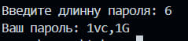

# 🔑 Генератор паролей

Простой учебный проект на Python, который создаёт случайные пароли разной длины с буквами, цифрами и символами.

## 🚀 Как запустить

1. Установите Python (если ещё не установлен).
2. Скачайте проект или клонируйте репозиторий.
3. Запустите программу:

## 📸 Скриншоты работы генератора паролей




```bash
python password.py


